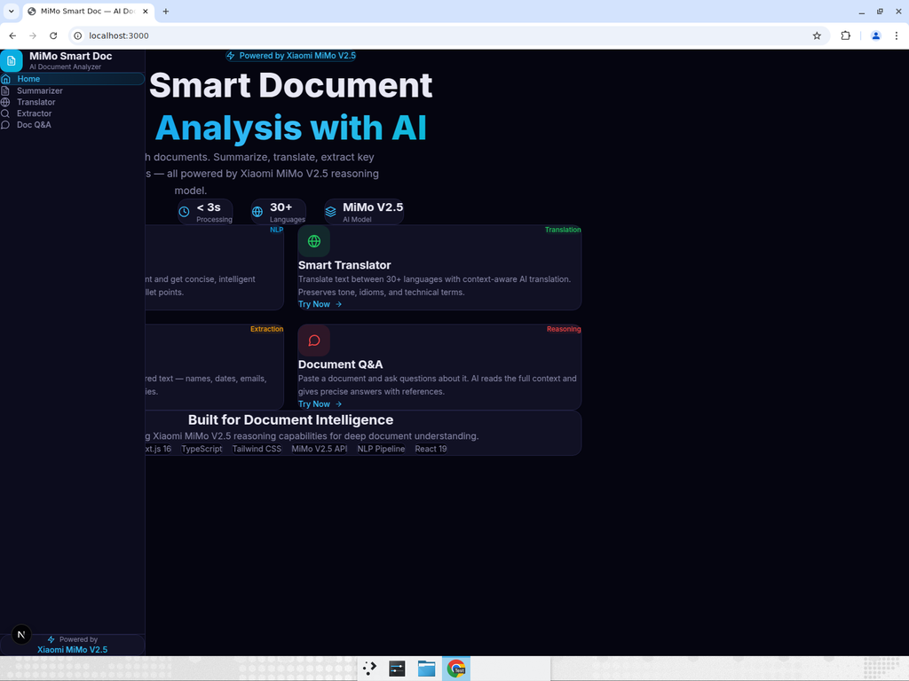
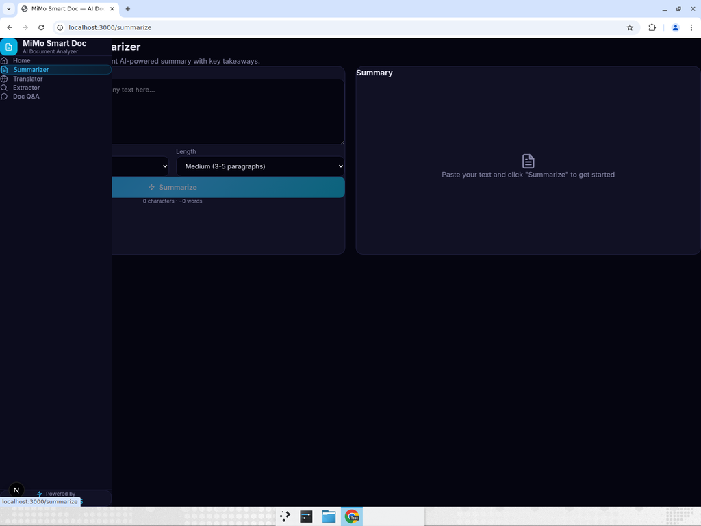
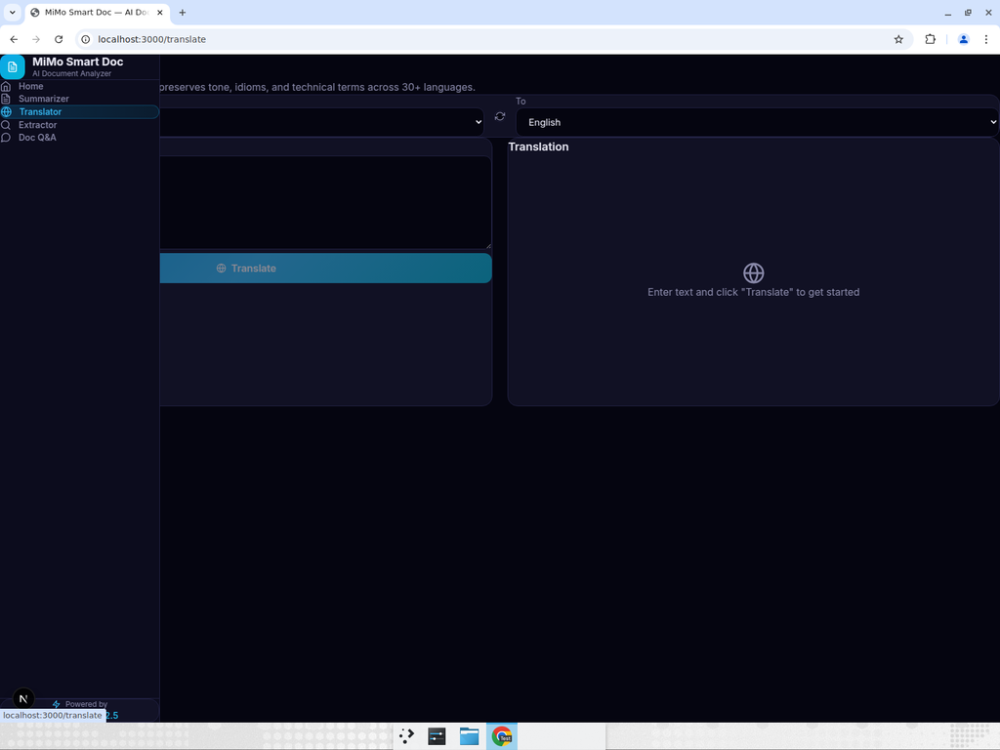
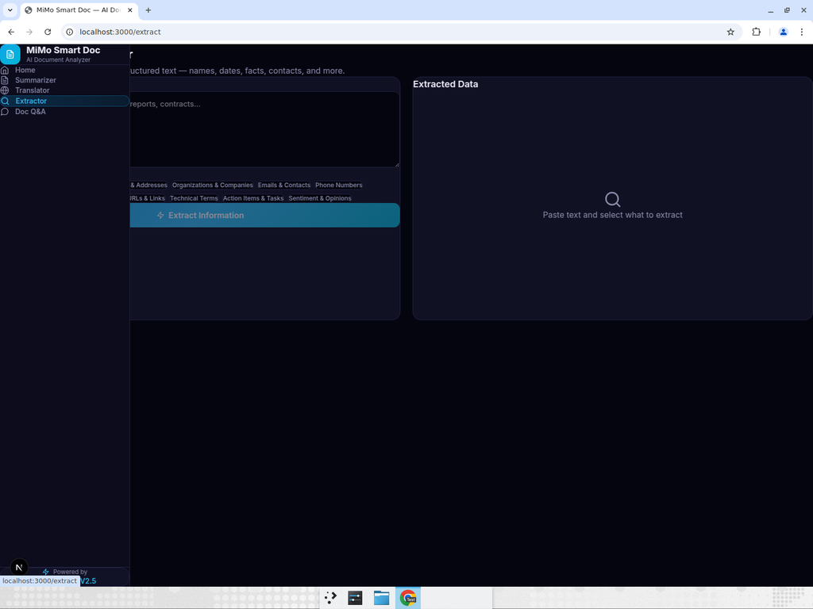
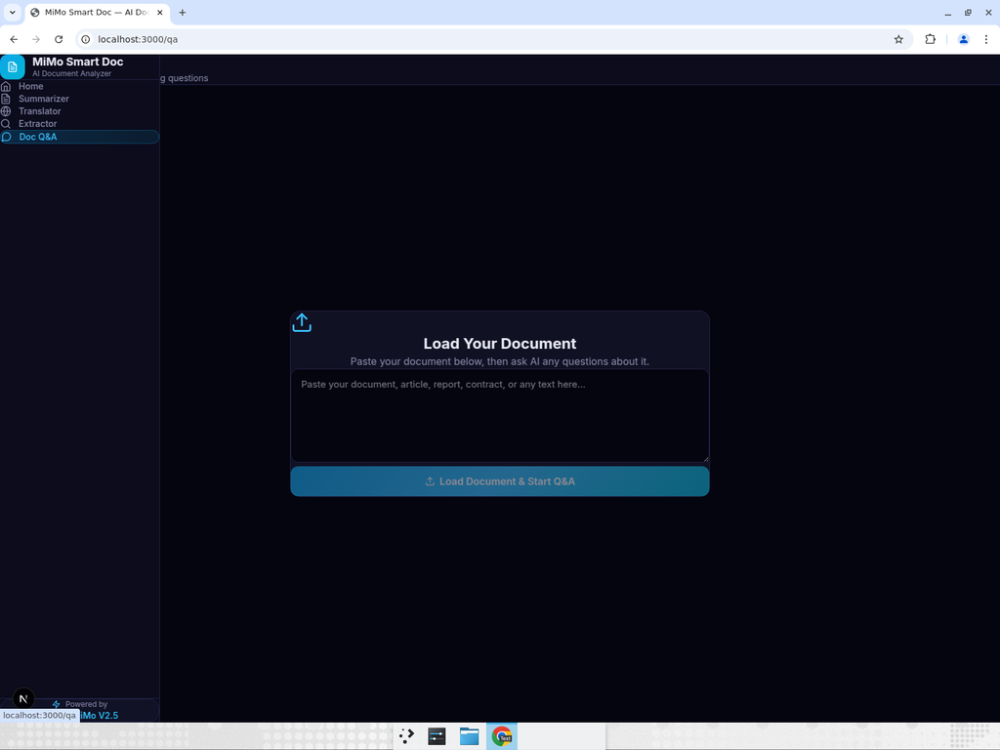

# MiMo Smart Doc — AI Document Analyzer

> AI-powered smart document analyzer built with **Xiaomi MiMo V2.5 API**. Summarize, translate, extract key information, and ask questions about any document.



## Features

### 1. Document Summarizer
Paste any long text, article, or document and get concise, intelligent summaries with key takeaways. Choose from multiple summary styles (Concise, Detailed, Executive Brief, Academic, Bullet Points) and customize the output length.



### 2. Smart Translator
Context-aware AI translation across 30+ languages. Unlike traditional translators, MiMo preserves tone, idioms, cultural expressions, and technical terminology. Supports auto-detection of source language.



### 3. Key Info Extractor
Extract structured data from unstructured text with high precision. Automatically identifies and categorizes: names, dates, locations, organizations, emails, phone numbers, key facts, statistics, URLs, technical terms, action items, and sentiment.



### 4. Document Q&A
Load any document and have an interactive Q&A conversation about its contents. AI reads the full context and provides precise answers with references. Supports multi-turn conversations with full context retention and chain-of-thought reasoning.



## Tech Stack

| Technology | Purpose |
|---|---|
| **Next.js 16** | React framework with App Router |
| **React 19** | UI component library |
| **TypeScript** | Type-safe development |
| **Tailwind CSS 4** | Utility-first CSS styling |
| **Xiaomi MiMo V2.5** | AI reasoning model (OpenAI-compatible API) |

## Getting Started

### Prerequisites
- Node.js 18+
- Xiaomi MiMo API key ([Get one here](https://platform.xiaomimimo.com))

### Installation

```bash
# Clone the repository
git clone https://github.com/brodisa922/mimo-smart-doc.git
cd mimo-smart-doc

# Install dependencies
npm install

# Configure environment
cp .env.example .env
# Edit .env and add your MiMo API key

# Start development server
npm run dev
```

Open [http://localhost:3000](http://localhost:3000) in your browser.

## Project Structure

```
mimo-smart-doc/
├── src/
│   ├── app/
│   │   ├── api/
│   │   │   ├── summarize/route.ts   # Summarization API
│   │   │   ├── translate/route.ts   # Translation API
│   │   │   ├── extract/route.ts     # Info extraction API
│   │   │   └── qa/route.ts          # Document Q&A API
│   │   ├── summarize/page.tsx       # Summarizer UI
│   │   ├── translate/page.tsx       # Translator UI
│   │   ├── extract/page.tsx         # Extractor UI
│   │   ├── qa/page.tsx              # Document Q&A UI
│   │   ├── page.tsx                 # Homepage
│   │   ├── layout.tsx               # Root layout
│   │   └── globals.css              # Global styles
│   ├── components/
│   │   └── Sidebar.tsx              # Navigation sidebar
│   └── lib/
│       └── mimo.ts                  # MiMo API client
├── .env.example                     # Environment template
├── package.json
└── README.md
```

## API Integration

This project uses the **Xiaomi MiMo V2.5 API** through an OpenAI-compatible endpoint. The API client supports:
- Standard request/response mode
- Configurable temperature and token limits
- Multiple model selection
- Error handling and retry logic

## Design

- **Dark theme** with glassmorphism effects
- **Responsive layout** for all screen sizes
- **Consistent UI** across all features
- **Accessibility-focused** design patterns

## License

MIT License — feel free to use and modify.
